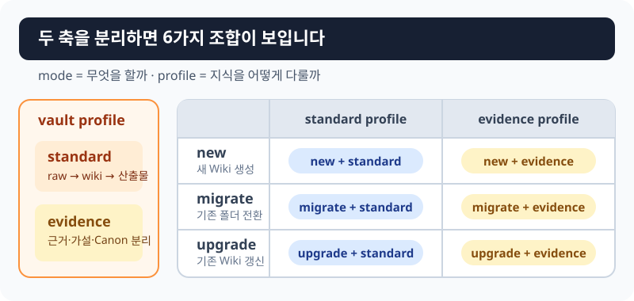
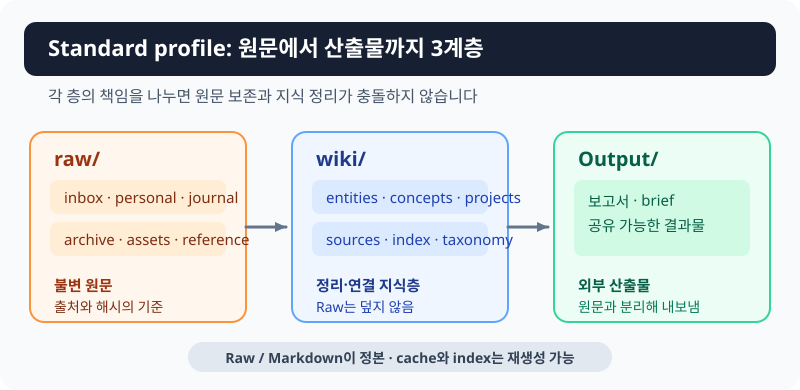
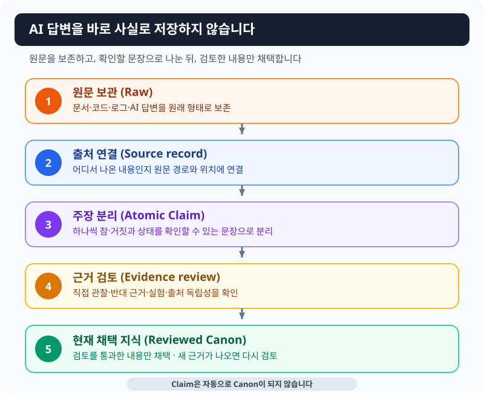
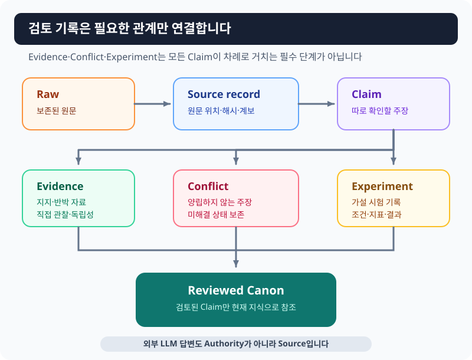
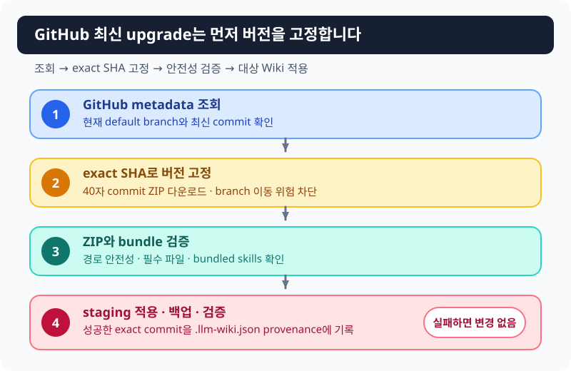
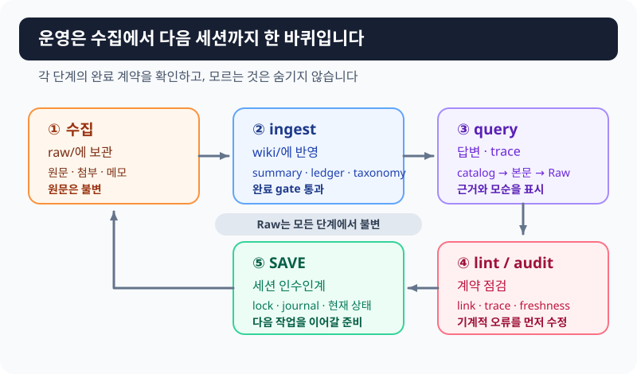

# llm-wiki-bootstrap

[한국어](README.ko.md) · [English](README.en.md)

A skill that helps Claude Code or Codex build a personal knowledge Wiki while preserving original files and, when needed, tracking sources and review status.

Files accumulate faster than people can organize them. AI summaries can blur what a source said and what a model inferred. Converting a folder or updating a Wiki can also feel risky.

This repository preserves originals in `raw/`, keeps AI-maintained knowledge in `wiki/`, offers simple `standard` and stricter `evidence` profiles, and separates creation, conversion, and updates into `new`, `migrate`, and `upgrade`. It does not automatically delete or overwrite existing files; conflicting managed documents become `.wiki-proposed` proposals.

> The shortest path: install the skill, then ask **“Convert this existing folder into a Wiki without losing files.”** You do not need to memorize commands.

## Quick links

- [30-second chooser](#30-second-chooser)
- [Quick start](#quick-start)
- [Standard](#standard-everyday-knowledge-organization)
- [Evidence](#evidence-manage-ai-answers-as-reviewable-knowledge)
- [Safety](#safety-for-existing-folders-and-wikis)
- [Advanced CLI](#advanced-cli)

## See the flow

<p align="center">
  <picture>
    <source media="(max-width: 600px)" srcset="docs/images/wiki-flow-animated-mobile.svg">
    
  </picture>
</p>

The skill reads a plain-language request, chooses what should happen to the folder and how knowledge should be managed, preserves the originals, and uses only organized or reviewed knowledge in the Wiki and its outputs. Environments without animation support still show the completed flowchart.

## 30-second chooser

Choose two separate things: what to do to the folder, and how strictly to manage knowledge.

| Choice | Use it when | Existing files | Example |
|---|---|---|---|
| `new` | The folder is missing or empty | Creates only the Wiki structure | New study Wiki |
| `migrate` | A normal folder already contains material | No automatic delete, move, or overwrite | Existing project notes |
| `upgrade` | The folder already has `raw/` and `wiki/` | Preserves originals and knowledge while refreshing managed assets | Update installed skills |

| Choice | Use it when | Flow | Default |
|---|---|---|---|
| `standard` | Study material, notes, articles, videos, and books | `raw → wiki → Output` | Start here for most Wikis |
| `evidence` | Reverse engineering, technical research, multi-LLM comparison, hypothesis testing | `Raw → Source → Claim → review → Canon` | Use when evidence and inference must stay separate |

[](docs/images/lifecycle-profile-matrix.svg)

`mode` and `profile` are independent axes. Valid combinations include `new + standard`, `migrate + evidence`, and `upgrade + evidence`. Upgrade never automatically downgrades Evidence to Standard.

Game projects add a third axis, project mode (`project_mode: game`). It is not a lifecycle mode or a profile.

## Quick start

### Requirements

- Claude Code or Codex
- Python 3.10+
- GitHub HTTPS access for online `upgrade`
- Graphify is optional

The skill can use `python`, `py -3`, or `python3`. A Windows Microsoft Store execution alias without a real Python installation is not sufficient.

### Install for Claude Code

macOS / Linux:

```bash
git clone https://github.com/gupilleveldesigner/llm-wiki-bootstrap "$HOME/.claude/skills/llm-wiki-bootstrap"
```

Windows PowerShell:

```powershell
git clone https://github.com/gupilleveldesigner/llm-wiki-bootstrap "$env:USERPROFILE\.claude\skills\llm-wiki-bootstrap"
```

### Install for Codex

macOS / Linux:

```bash
git clone https://github.com/gupilleveldesigner/llm-wiki-bootstrap "$HOME/.codex/skills/llm-wiki-bootstrap"
```

Windows PowerShell:

```powershell
git clone https://github.com/gupilleveldesigner/llm-wiki-bootstrap "$env:USERPROFILE\.codex\skills\llm-wiki-bootstrap"
```

The repository includes `agents/openai.yaml` for Codex.

### Ask in plain language

```text
Create a Wiki for studying cooking.
Convert this existing folder into a Wiki without losing files.
Create an Evidence Wiki that separates AI answers from verified facts.
Upgrade this Wiki's operational skills to the latest GitHub version.
```

You can also invoke `/llm-wiki-bootstrap` in Claude Code or `$llm-wiki-bootstrap` in Codex. The skill reuses information already supplied.

## Standard: everyday knowledge organization

```text
preserve originals (raw/) → organize and connect (wiki/) → publish results (Output/)
```

[](docs/images/standard-structure.svg)

- `raw/` preserves articles, notes, transcripts, and other originals.
- `wiki/` contains summaries and connections maintained from those originals.
- `Output/` contains documents and reports intended for sharing.

If an AI-maintained Wiki page is wrong, the original remains available for review.

<details>
<summary>Full Standard folder layout</summary>

```text
MyWiki/
├─ raw/inbox/ · personal/ · journal/ · archive/ · assets/ · reference/
├─ wiki/entities/ · concepts/ · projects/ · sources/
├─ Output/ · instructions/ · templates/
├─ .agents/skills/ · .claude/skills/ · .session-memory/
├─ CLAUDE.md · AGENTS.md · log.md · changelog.md
└─ .llm-wiki.json
```

</details>

## Evidence: manage AI answers as reviewable knowledge

### AI output is not stored as fact by default

[](docs/images/evidence-workflow.svg)

1. **Preserve the original (Raw):** keep documents, code, logs, and AI answers in their original form.
2. **Link the source (Source record):** connect extracted information to where it came from.
3. **Separate claims (Atomic Claim):** split content into independently checkable statements.
4. **Review evidence:** inspect observations, supporting and opposing material, experiments, and source independence.
5. **Adopt current knowledge (Reviewed Canon):** use only reviewed material as the project's current conclusion.

Reviewed Canon is not absolute truth. It is the conclusion the project currently adopts based on available evidence. New evidence can change it. A Claim never becomes Canon automatically.

### Understand Atomic Claims through one example

The following scenario only explains Atomic Claims; it is not an event from this repository.

> “A test failed on Windows, so the product has a Windows-only regression.”

Split it into independently checkable statements:

- A test failed on windows-latest with Python 3.12.
- The failure occurred in repository tests.
- The Ubuntu job passed.
- The cause is an operating-system-specific path representation difference.
- The product code has a Windows-only regression.
- The failure is a test-assumption problem rather than a product problem.

The first three can be checked in logs. The path explanation needs investigation. Product regression and test-assumption failure may remain competing hypotheses until a fix is rerun.

> If one part could be true while another is false, split the sentence into more than one Claim.

### Read states before confidence numbers

Start with directly observed, inferred, hypothesis, supported conclusion, rejected or disputed, and unknown. Numeric `confidence` is secondary and never overrides the state. Keep `UNKNOWN` when material is insufficient.

<details>
<summary>Actual Claim states</summary>

| State | Meaning |
|---|---|
| `OBSERVED` | Directly observed in source, code, log, or output |
| `INFERRED` | Inferred but not directly verified |
| `HYPOTHESIS` | Needs testing |
| `SUPPORTED` | Supported but not decisive |
| `CONFIRMED` | Directly evidenced or sufficiently verified |
| `REJECTED` | Refuted and retained as history |
| `DISPUTED` | Has valid conflicting evidence |
| `DEPRECATED` | Retained for historical use only |
| `UNKNOWN` | Cannot be judged from current material |

</details>

### Relayed model answers are not independent sources

```text
ChatGPT answer → given to Qwen → given to Codex
```

If the information descends from one answer, three models do not create three independent pieces of evidence. The system records source lineage with `parent_sources` or equivalent provenance. An external LLM answer is a Source, not an Authority.

### Review records form a graph, not one mandatory pipeline

[](docs/images/evidence-data-model.svg)

Evidence supports or contradicts a Claim. Conflict preserves incompatible Claims. Experiment records how a hypothesis was tested. Reviewed Canon references only reviewed Claims. Not every Claim must pass through Conflict and Experiment in sequence. `canon-review` is read-only by default.

<details>
<summary>Main folders added by Evidence</summary>

```text
wiki/sources/ · claims/ · decisions/ · conflicts/ · experiments/
wiki/questions/open/ · answered/ · blocked/
wiki/canon/ · evidence-model.md
templates/evidence/ · instructions/evidence-operations.md · tools/kb.py
.wiki-cache/normalized/ · index/ · embeddings/
```

`.wiki-cache/` is regenerable derived data, not authoritative project knowledge.

</details>

## Safety for existing folders and Wikis

### Convert an existing folder (`migrate`)

- Existing files are not automatically deleted, edited, or moved.
- Conflicting managed documents become `.wiki-proposed` proposals.
- Moving material into `raw/` requires a per-file plan and approval.
- Project settings such as `.git` are not treated as Raw.
- A symlink inside the target stops the operation before writes can escape the Wiki root.

### Update an existing Wiki (`upgrade`)

- `raw/`, existing knowledge, and `Output/` are preserved.
- The updater first resolves the default branch and exact 40-character commit SHA.
- It does not touch the target before validating the ZIP and required bundle.
- Apply and verification run in a sibling staging copy on the same filesystem.
- Operational skills are backed up under `.wiki-upgrade-bak/<timestamp>-<unique-id>/`.
- Apply or post-check failure keeps or restores the original Wiki.
- GitHub failure is never reported as success using a stale local bundle.

[](docs/images/upgrade-flow.svg)

Pinning the SHA makes the applied version reproducible. Success records `.llm-wiki.json.last_upgrade` and `bootstrap_commit`.

`upgrade.py` finds and validates GitHub latest. `bootstrap.py --mode upgrade` applies an already prepared version. Promotion can leave `profile_activation_pending: true` when user-edited routers need review.

<details>
<summary>Internal upgrade flow</summary>

```text
metadata → default branch → exact SHA → ZIP validation
→ sibling staging → backup → apply and post-check → rename or restore
```

Important results: `upgrade_source`, `bootstrap_commit`, `backup_dir`, and `profile_activation_pending`. `--source local` is explicit offline use and is never called GitHub latest.

</details>

## Operational skills

[](docs/images/operations-loop.svg)

| Skill | Use it when | What it does | Does not do |
|---|---|---|---|
| `ingest` | New Raw should enter the Wiki | Creates linked Source records and summaries without editing Raw | Change Canon automatically |
| `query` | You need a Wiki-grounded answer | Opens indexes, selected pages, and Raw as needed | Fill gaps from model memory |
| `lint` | Links, metadata, or freshness need checks | Fixes safe mechanical issues | Decide facts, merge, or delete by judgment |
| `session-memory` | Work must continue later | Saves state on `SAVE` with an atomic transaction | Mark unrun checks complete |
| `brief-tuner` | A work brief needs calibration | Tunes templates through an interview | Choose the user's criteria |
| `wiki-audit` | Installation needs checking | Read-only contract and environment inspection | Modify files |
| `canon-review` | An Evidence conclusion may be promoted | Reviews source quality, independence, conflicts, and experiments | Promote automatically |

Evidence query modes are current answer (`answer`), investigation (`research`), claim verification (`verify`), opposing-evidence search (`challenge`), Raw trace (`trace`), and source comparison (`compare`).

## Game project support

Game is neither a lifecycle mode nor a profile. It is a separate project mode (`project_mode: game`) and works with `standard + game` or `evidence + game`.

```text
Workspace/
├─ MyGame/       live code, scenes, data, source assets (project_root)
└─ MyGame.wiki/  design, implementation checks, builds, playtests, decisions (vault_root)
```

The default is a sibling sidecar Wiki. Engine markers for Unity, Unreal, Godot, and web projects select protected paths and source roots. Installation and upgrade write only to `vault_root`. Design and live implementation remain separate, ingest never overwrites either automatically, and `game_project.py --mode upgrade` updates the base Wiki and Game overlay together.

Inspect the write plan first:

```bash
python scripts/game_project.py \
  --project-root ./MyGame \
  --config ./config.game.json \
  --mode migrate \
  --profile standard \
  --dry-run
```

See [`config.game.example.json`](config.game.example.json) and the [Game project mode guide](GAME_PROJECT_MODE.en.md).

## Optional features and preservation boundary

Graphify is an optional exploration aid. Use `$graphify <WIKI_ROOT>` in Codex or `/graphify <WIKI_ROOT>` in Claude Code. Raw and Markdown remain authoritative.

Obsidian Web Clipper templates under `templates/web-clipper/` collect material in `raw/reference/`; collected Raw is not current knowledge before ingest and review.

Preserve `raw/`, `wiki/sources/`, Evidence `wiki/claims/`, `wiki/canon/`, `wiki/experiments/`, and needed `.session-memory/` records. `.wiki-cache/`, Graphify output, derived indexes, and embeddings are regenerable.

## Advanced CLI

The basic configuration matches [`config.example.json`](config.example.json).

```json
{"project_name": "My Wiki", "domain_summary": "One-sentence project purpose"}
```

On Windows, `py -3` can replace `python`.

```bash
python scripts/bootstrap.py --target ./MyWiki --config ./config.json --mode new --profile standard
python scripts/bootstrap.py --target ./ResearchWiki --config ./config.json --mode new --profile evidence
python scripts/bootstrap.py --target ./ExistingProject --config ./config.json --mode migrate --profile evidence
python scripts/upgrade.py --target ./ExistingWiki --config ./config.json
python scripts/upgrade.py --target ./ExistingWiki --config ./config.json --profile evidence
python scripts/upgrade.py --target ./ExistingWiki --config ./config.json --source local
```

## Post-install checks

```bash
python ".claude/skills/ingest/scripts/ingest_runtime.py" status
python ".session-memory/scripts/session_memory.py" status
```

Check core files and placeholders; Evidence runtime and `canon-review`; upgrade results and `.llm-wiki.json.last_upgrade.commit`; and, for Game, `tools/game_trace.py verify` plus project integrity.

## Design principles and non-goals

Raw is immutable. In Evidence, LLM output is a Source rather than an Authority. One lineage is not inflated into multiple independent sources. Rejections, conflicts, and failed experiments remain visible. Unknowns remain `UNKNOWN`. Claim and Canon are separate. `migrate` and `upgrade` are non-destructive. GitHub failure is never hidden behind a stale local fallback.

The default system does not require Kubernetes, a large vector database, a Neo4j cluster, microservices, or an external database as the source of truth. It remains file- and Markdown-first.

## Glossary

| Term | Plain meaning |
|---|---|
| Raw | An original preserved without modification |
| Source record | A record linking content to where it came from |
| Claim | An independently judgeable statement |
| Atomic Claim | A Claim containing one point |
| Evidence | Material or observation supporting or contradicting a Claim |
| Conflict | A preserved record of incompatible Claims |
| Experiment | Conditions, method, metrics, and results used to test a hypothesis |
| Canon | Knowledge currently adopted after review, not absolute truth |
| provenance | A record of where information came from |
| lineage | The path information followed through sources and AI systems |
| locator | A pointer to an exact section, line, message, or function in Raw |
| cache | Derived data that can be recreated from originals |

## License

MIT
